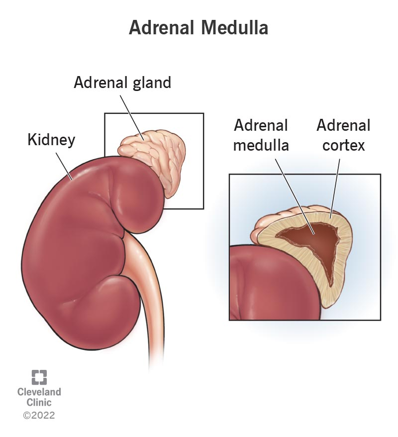

## Chromaffin cell

Chromaffin cell differentiation is the developmental process where multipotent neural crest cells (MNC) or Schwann cell precursors (SCP) become specialized, **hormone-secreting endocrine cells** in the **adrenal medulla** that produce catecholamines like adrenaline and noradrenaline. 

### Origin and Migration

- Neural Crest Source: Cells originate from the trunk neural crest.
- Schwann Cell Precursors: Current research shows many chromaffin cells arise from neuron-associated Schwann cell precursors rather than direct-lineage precursors.
- Migration Path: Precursors migrate along preganglionic sympathetic nerves into the developing adrenal region. 

### Key Regulatory Signals

- Signaling Molecules: Bone morphogenetic proteins (such as BMP2 and BMP4) and fibroblast growth factors (FGF2) drive the sympathoadrenal fate.
- Transcription Factors: Key markers expressed during specification include SOX10, ASCL1, TFAP2A, and PHOX2B.
- Hormonal Influence: Corticosteroids from the surrounding adrenal cortex promote the final endocrine phenotype and upregulate specific enzymes like PNMT (phenylethanolamine N-methyltransferase). 

Mature Phenotype
- Hormone Synthesis: Cells specialize in storing and releasing adrenaline, noradrenaline, and active neuropeptides.
- Plasticity: Mature or progenitor chromaffin cells retain a degree of plasticity and can-under specific neurotrophic or experimental cues-differentiate into neuron-like cells. 

