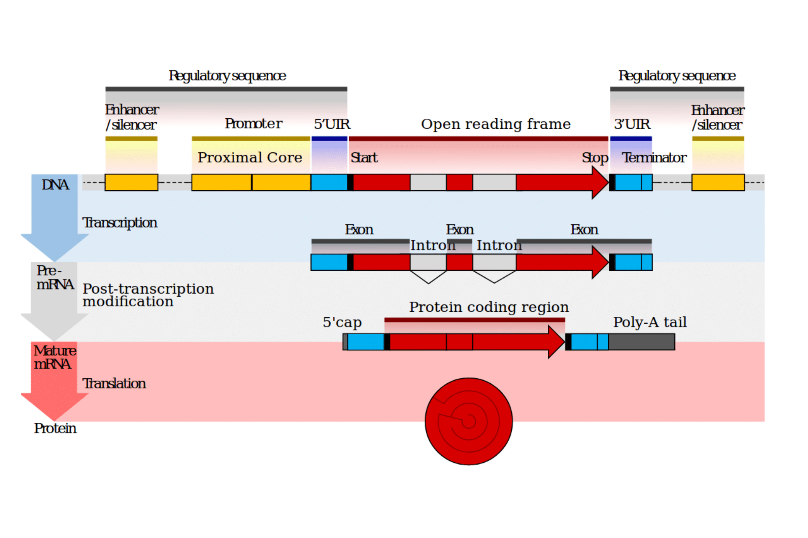
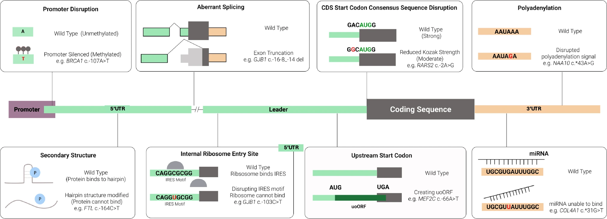

## DNA -> RNA -> Protein

https://www.biostars.org/p/277822/

### Aberrant Splicing

Ref: Wieder N, D'Souza EN, Dawes R, Chan A, Martin-Geary A, Whiffin N. The role of untranslated region variants in Mendelian disease: a review. Eur J Hum Genet. 2025 Sep;33(9):1096-1105. doi: 10.1038/s41431-025-01905-x. Epub 2025 Jul 3. PMID: 40610610; PMCID: PMC7617937.

## Sequencing technologies

### Smart-Seq2

Smart-Seq2 is a popular, highly sensitive molecular biology method used for full-length RNA sequencing from single cells. It optimizes the template-switching mechanism during reverse transcription to generate high-quality complementary DNA (cDNA) libraries, allowing researchers to study gene expression, splice isoforms, and single-nucleotide polymorphisms. 

[Full-length RNA-seq from single cells using Smart-seq2](https://pubmed.ncbi.nlm.nih.gov/24385147/)

- Full-Length Coverage: Captures information across the entire transcript rather than just the 3' or 5' ends. 
- High Sensitivity: Can successfully sequence mRNA from single cells or very low input amounts (as little as ~50 pg). 
- Standard Reagents: Uses widely available commercial enzymes and oligos (such as locked nucleic acid modified template-switching oligos and optimized PCR mixes). 

### Main Steps in the Protocol

- Cell Lysis: Breaks open the single cell in a controlled buffer that preserves RNA integrity. 
- Reverse Transcription: Converts mRNA into first-strand cDNA using oligo(dT) primers and template-switching oligonucleotides. 
- Preamplification: Amplifies the full-length cDNA via PCR. 
- Library Construction: Tagmentation or fragmentation prepares the amplified DNA for high-throughput sequencing. 

